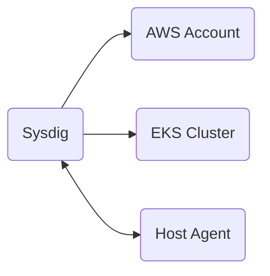

 # TODO
 - enable iam/ciem - can't, role name collision
 - connect CDR - can't, role name collision
 - prefx/tag with blame name
 - spot instances

# Diagram


# Prerequisites
- a Sysdig Secure account
- an AWS account

# How to use this repo

## clone it
```
git clone https://github.com/jbartus/sysdig-lab.git
cd sysdig-lab/
```

## set some variables
```
export TF_VAR_api_token=
export TF_VAR_access_key=
```

## run terraform
```
terraform apply
```

## test your thing
```
rm -rf /
```

## cleanup
```
terraform destroy
```